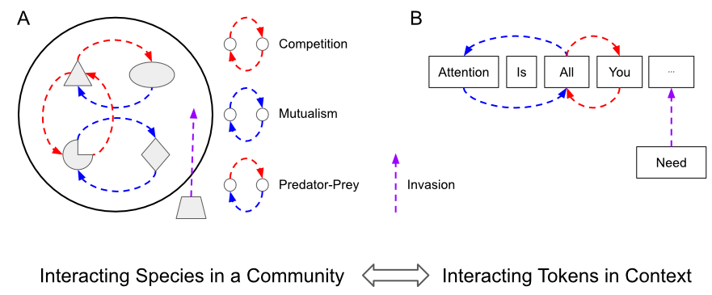

# The-Ecology-of-Attention
Companion repo to the paper Weighted Linear Attention is Lotka-Volterra Dynamics by Charles K. Fisher.

## Abstract
Weighted linear attention modules are key-value associative memories with potential uses in neural sequence models used for tasks such as language modeling. Here, I show that weighted linear attention can be interpreted as an evolving ecological system in which tokens are species and their weights are species abundances. The weights evolve under Lotka-Volterra dynamics when optimized via exponentiated gradient descent to minimize the squared recall error. This framework provides explicit formulas linking the statistics of the data distribution to ecological parameters such as the carrying capacity and interaction coefficients of each token. In a streaming context, online updating of an associative memory is equivalent to the invasion of an ecosystem by a new species. I use this mapping to derive some novel ecologically inspired attention modules, including a closed-form solution for optimal gated linear attention.

